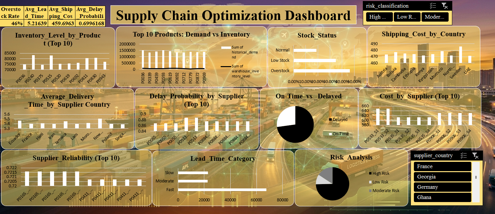
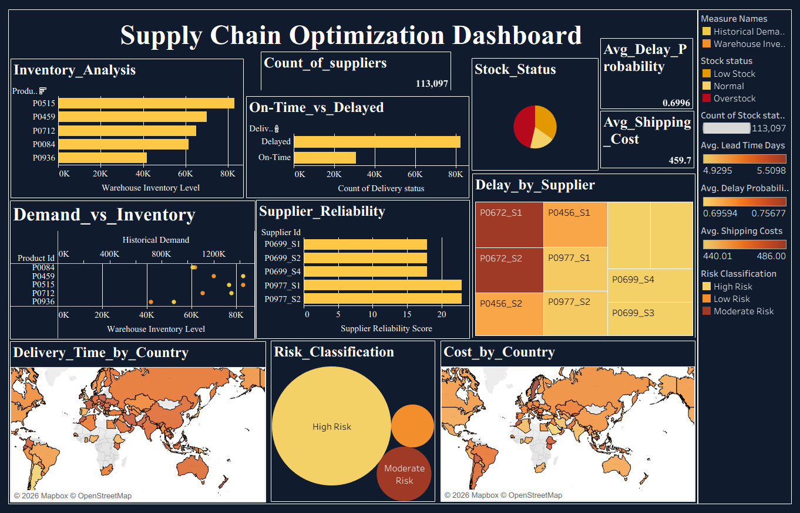

#  Supply Chain Optimization Dashboard
 Data-driven analysis to optimize supply chain efficiency and reduce operational costs

##  Project Overview
This project focuses on analyzing logistics and inventory data to identify inefficiencies in the supply chain and recommend improvements to reduce costs and delays.

Interactive dashboards were created using:
-  Excel
-  Tableau

---

##  Task Description

**Task:**  
Examine logistics and inventory datasets to identify inefficiencies in the supply chain and recommend improvements to reduce costs and delays.

---

##  Objective
To analyze supply chain data and identify:
- Inventory inefficiencies (overstock/stockouts)
- Logistics delays
- Cost inefficiencies
- Supplier performance issues

---

##  Tools & Technologies
- Microsoft Excel (Pivot Tables, Charts, Dashboard Design)
- Tableau (Data Visualization, Interactive Dashboards)
- Data Cleaning & Analysis

---

##  Repository Structure
- Excel Dashboard
- Tableau Dashboard
- README.md

##  Dataset
- dynamic_supply_chain_logistics_dataset_with_country (Kaggle)
- Data is integrated within the dashboards for analysis
---

##  Dashboards

###  Excel Dashboard

###  Tableau Dashboard

---

##  Key Analyses Performed

### 1.  Inventory Analysis
- Inventory Level by Product (Top 10)
- Demand vs Inventory comparison
- Stock Status distribution  

 Identified overstock conditions indicating inefficient inventory management.

---

### 2.  Logistics & Delay Analysis
- Average Delivery Time by Supplier Country
- Delay Probability by Supplier (Top 10)
- On-Time vs Delayed Deliveries  

 Identified delay-prone suppliers and regions.

---

### 3.  Cost Analysis
- Shipping Cost by Country
- Cost by Supplier (Top 10)  

 Highlighted high-cost suppliers with lower efficiency.

---

### 4.  Supplier Performance Analysis
- Supplier Reliability (Top 10)
- Lead Time Category
- Risk Classification  

 Evaluated supplier efficiency and operational risks.

---

##  Key Insights

- A large portion of inventory is **overstocked**, leading to increased holding costs.
- Certain suppliers exhibit **high delay probability**, impacting delivery timelines.
- Some regions show **higher average lead times**, indicating logistics inefficiencies.
- Higher shipping costs do not always guarantee faster delivery.
- Supplier reliability varies, affecting overall supply chain performance.
- A majority of operations fall under **high-risk classification**.

---

##  Recommendations

- Implement **demand forecasting techniques** to reduce overstock and stockouts.
- Optimize supplier selection based on **reliability and delivery performance**.
- Improve logistics planning to reduce **lead times and delays**.
- Monitor and renegotiate contracts with **high-cost suppliers**.
- Maintain optimal **inventory levels and safety stock**.
- Reduce risks through better **supply chain monitoring and data-driven decisions**.

---

##  Project Outcome
This project delivers an end-to-end analysis of supply chain operations by identifying critical inefficiencies in inventory management, logistics, cost structures, and supplier performance.

The dashboards enable data-driven decision-making to:
- Reduce operational and shipping costs
- Minimize delivery delays
- Improve supplier selection and performance monitoring
- Optimize inventory levels and reduce holding costs

Overall, the solution provides actionable insights to enhance supply chain efficiency and operational effectiveness.

---

##  Contact
Feel free to connect with me on LinkedIn for feedback or collaboration opportunities.
